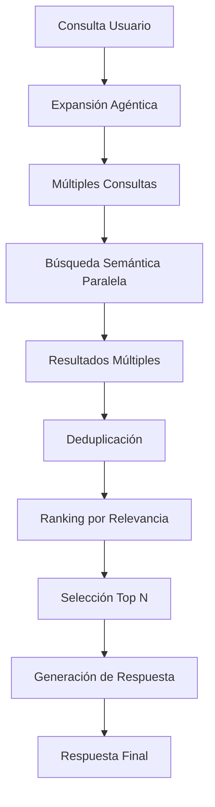

# Análisis Exhaustivo del Agentic RAG Service

## 📋 Resumen Ejecutivo

El **Agentic RAG Service** es un sistema híbrido que combina capacidades de **Retrieval-Augmented Generation (RAG)** con **Model Context Protocol (MCP)** para crear un servicio inteligente especializado en sumillería y gestión de conocimiento vinícola. El sistema implementa arquitectura agéntica con capacidades de expansión de consultas, búsqueda semántica avanzada y generación de respuestas contextualizadas.

---

## 🏗️ Arquitectura del Sistema

### **Arquitectura General**
```
┌─────────────────────────────────────────────────────────────┐
│                    AGENTIC RAG SERVICE                      │
├─────────────────────────────────────────────────────────────┤
│  ┌─────────────────┐    ┌─────────────────┐                │
│  │   FastAPI       │    │   MCP Server    │                │
│  │   HTTP API      │    │   Protocol      │                │
│  └─────────────────┘    └─────────────────┘                │
├─────────────────────────────────────────────────────────────┤
│              AgenticRAGEngine (Core)                        │
│  ┌─────────────────┐    ┌─────────────────┐                │
│  │ Query Expansion │    │ Answer Generation│                │
│  │    (OpenAI)     │    │    (OpenAI)     │                │
│  └─────────────────┘    └─────────────────┘                │
│  ┌─────────────────┐    ┌─────────────────┐                │
│  │ Semantic Search │    │ Document Store  │                │
│  │  (ChromaDB)     │    │   (ChromaDB)    │                │
│  └─────────────────┘    └─────────────────┘                │
│  ┌─────────────────┐                                        │
│  │   Embeddings    │                                        │
│  │ (SentenceTransf)│                                        │
│  └─────────────────┘                                        │
└─────────────────────────────────────────────────────────────┘
```

### **Componentes Principales**

#### 1. **AgenticRAGEngine** (Líneas 60-320)
- **Propósito**: Motor central del sistema RAG con capacidades agénticas
- **Responsabilidades**:
  - Gestión de embeddings con SentenceTransformers
  - Búsqueda semántica en ChromaDB
  - Expansión agéntica de consultas
  - Generación de respuestas contextualizadas
  - Gestión de documentos

#### 2. **MCP Server** (Líneas 322-827)
- **Propósito**: Servidor de protocolo MCP para integración con sistemas externos
- **Herramientas**: 12 herramientas especializadas en sumillería
- **Recursos**: Acceso a estadísticas y documentos de la base de conocimiento

#### 3. **FastAPI Application** (Líneas 888-1058)
- **Propósito**: API HTTP para acceso directo al servicio
- **Endpoints**: `/health`, `/query`, `/documents`
- **Funcionalidades**: Carga automática de documentos, métricas de rendimiento

---

## 🔧 Funcionalidades Detalladas

### **1. Motor RAG Agéntico (AgenticRAGEngine)**

#### **Inicialización y Configuración**
```python
# Líneas 75-122
async def initialize(self):
```
- **Flexibilidad de Despliegue**: Soporta ChromaDB embebido (Railway/Cloud) y cliente HTTP (local)
- **Configuración Adaptativa**: Detecta automáticamente el entorno (`ENVIRONMENT=railway`)
- **Fallback Robusto**: Crea instancia mínima si falla la inicialización principal
- **Gestión de Colecciones**: Recupera o crea colección `rag_documents` con configuración coseno

#### **Generación de Embeddings**
```python
# Líneas 123-125
def _embed_text(self, text: str) -> List[float]:
```
- **Modelo**: `all-MiniLM-L6-v2` (384 dimensiones)
- **Optimización**: Modelo ligero pero efectivo para español
- **Consistencia**: Embeddings determinísticos para mismas entradas

#### **Gestión de Documentos**
```python
# Líneas 127-149
async def add_document(self, content: str, metadata: Dict[str, Any] = None, doc_id: str = None) -> str:
```
- **ID Automático**: Genera IDs únicos si no se proporcionan
- **Metadata Rica**: Soporte completo para metadatos estructurados
- **Embeddings Automáticos**: Calcula y almacena embeddings al agregar
- **Logging Detallado**: Rastrea todas las operaciones de documentos

#### **Búsqueda Semántica Avanzada**
```python
# Líneas 150-180
async def semantic_search(self, query: str, max_results: int = 5) -> List[Dict[str, Any]]:
```
- **Algoritmo**: Búsqueda por similitud coseno en espacio vectorial
- **Scoring**: Convierte distancias a scores de relevancia (1 - distance)
- **Ranking**: Ordena resultados por relevancia
- **Metadata Preservada**: Mantiene toda la información contextual

#### **Expansión Agéntica de Consultas** ⭐
```python
# Líneas 181-228
async def agentic_query_expansion(self, query: str, context: Dict[str, Any] = None) -> List[str]:
```
**Funcionalidad Clave del Sistema Agéntico:**
- **LLM-Powered**: Usa OpenAI para generar variaciones inteligentes de consultas
- **Contexto Consciente**: Incorpora contexto adicional en la expansión
- **Sinónimos y Reformulaciones**: Genera términos relacionados y diferentes expresiones
- **Fallback Graceful**: Retorna consulta original si falla la expansión
- **Parsing Robusto**: Maneja respuestas JSON y texto plano del LLM

**Ejemplo de Expansión:**
```
Consulta Original: "vino tinto para asado"
Expansiones Generadas:
- "vino tinto robusto para carnes rojas"
- "vino con taninos para barbacoa"
- "vino estructurado para asado argentino"
- "malbec o cabernet para parrilla"
```

#### **Generación de Respuestas Contextualizadas**
```python
# Líneas 229-272
async def generate_answer(self, query: str, sources: List[Dict[str, Any]], context: Dict[str, Any] = None) -> str:
```
- **Prompt Engineering**: Sistema especializado en sumillería
- **Limitación de Fuentes**: Máximo 3 fuentes para evitar sobrecarga
- **Citación Automática**: Referencias a fuentes en las respuestas
- **Control de Alucinaciones**: Instrucciones explícitas contra información no fundamentada
- **Temperatura Optimizada**: 0.3 para respuestas precisas y consistentes

#### **Pipeline RAG Agéntico Completo** ⭐⭐
```python
# Líneas 273-320
async def agentic_rag_query(self, query: str, context: Dict[str, Any] = None, max_results: int = 5) -> RAGResponse:
```
**Proceso de 4 Etapas:**

1. **Expansión Agéntica**: Genera múltiples variaciones de la consulta
2. **Búsqueda Multi-Consulta**: Ejecuta búsquedas semánticas para cada variación
3. **Deduplicación Inteligente**: 
   - Hash de primeros 100 caracteres para detectar duplicados
   - Ranking por relevancia combinada
   - Selección de top resultados únicos
4. **Generación Contextualizada**: Produce respuesta final con fuentes

### **2. Herramientas MCP Especializadas**

El sistema implementa **12 herramientas MCP** organizadas en 5 categorías:

#### **RAG Básicas** (2 herramientas)
- `buscar_vinos`: Búsqueda semántica especializada en vinos
- `agregar_documento`: Gestión dinámica de la base de conocimiento

#### **Maridaje** (2 herramientas)
- `sugerir_maridaje`: Recomendaciones contextuales plato-vino
- `crear_menu_maridaje`: Menús completos con maridajes múltiples

#### **Análisis de Vinos** (2 herramientas)
- `analizar_vino`: Análisis detallado de características específicas
- `comparar_vinos`: Comparaciones multi-criterio entre vinos

#### **Recomendación** (2 herramientas)
- `recomendar_por_presupuesto`: Filtrado por rango de precios
- `recomendar_por_region`: Especialización geográfica

#### **Educación Vinícola** (2 herramientas)
- `explicar_concepto`: Educación técnica adaptativa por nivel
- `guia_cata`: Instrucciones paso a paso para cata profesional

#### **Gestión de Bodega** (2 herramientas)
- `calcular_inventario`: Estadísticas y análisis de stock
- `temperaturas_servicio`: Guías técnicas de servicio

### **3. Implementación de Herramientas MCP**

#### **Búsqueda de Vinos** (Líneas 640-670)
```python
if name == "buscar_vinos":
```
- **Filtrado Inteligente**: Solo documentos tipo 'vino'
- **Formato Rico**: Información estructurada (tipo, región, precio, puntuación)
- **Presentación Profesional**: Formato markdown con emojis y estructura clara

#### **Sugerencias de Maridaje** (Líneas 680-730)
```python
elif name == "sugerir_maridaje":
```
- **Consulta Expandida**: Combina plato + ocasión en búsqueda semántica
- **Filtrado por Presupuesto**: Aplicación opcional de límites de precio
- **Fallback Educativo**: Consejos generales si no hay resultados específicos
- **Contexto de Ocasión**: Adaptación a diferentes tipos de eventos

#### **Explicación de Conceptos** (Líneas 731-790)
```python
elif name == "explicar_concepto":
```
**Sistema Educativo Multinivel:**
- **Búsqueda en Base de Conocimiento**: Prioriza información almacenada
- **Explicaciones Predefinidas**: Diccionario de conceptos clave
- **Niveles Adaptativos**: Básico, intermedio, avanzado
- **Consejos Prácticos**: Aplicación real de conceptos teóricos

**Conceptos Implementados:**
- **Taninos**: Desde sensación básica hasta química avanzada
- **Terroir**: Desde factores ambientales hasta interacciones complejas
- **Decantación**: Desde separación básica hasta oxigenación controlada

#### **Temperaturas de Servicio** (Líneas 791-827)
```python
elif name == "temperaturas_servicio":
```
- **Base de Datos Técnica**: 9 categorías de vinos con rangos específicos
- **Consejos Contextuales**: Adaptados por tipo de vino y contexto
- **Guías Prácticas**: Instrucciones de implementación real
- **Reglas Generales**: Principios fundamentales de servicio

### **4. API HTTP (FastAPI)**

#### **Endpoint de Consultas** (Líneas 961-1048)
```python
@app.post("/query")
async def query_rag_mcp(query_data: QueryRequest):
```
**Pipeline Optimizado con Métricas:**
1. **Validación de Entrada**: Verificación de modelo Pydantic
2. **Inicialización Lazy**: Asegura motor RAG inicializado
3. **Generación de Embeddings**: Con medición de tiempo
4. **Búsqueda en ChromaDB**: Con logging de rendimiento
5. **Construcción de Contexto**: Formateo para LLM
6. **Generación con OpenAI**: Llamada optimizada con parámetros específicos
7. **Logging Completo**: Métricas de cada etapa del pipeline

**Configuración OpenAI Optimizada:**
- **Modelo**: Configurable via `OPENAI_MODEL`
- **Temperatura**: 0.7 para balance creatividad/precisión
- **Max Tokens**: 1024 para respuestas completas
- **Parámetros Avanzados**: top_p, frequency_penalty, presence_penalty

#### **Carga Automática de Documentos** (Líneas 893-955)
```python
@app.on_event("startup")
async def startup_event():
```
**Sistema de Carga Inteligente:**
- **Detección de Directorio**: `/app/knowledge_base` para contenedores
- **Soporte Multi-Formato**: `.txt` y `.json`
- **Procesamiento Especializado de Vinos**:
  - Detección automática de `vinos.json`
  - Estructuración rica de contenido
  - Metadata completa para búsquedas
  - IDs únicos generados automáticamente

**Estructura de Documento de Vino:**
```
Vino: [nombre]
Tipo: [tipo]
Región: [región]
Año: [vintage]
Precio: [precio]€
Stock: [stock] unidades
Maridaje: [pairing]
Descripción: [description]
Puntuación: [rating]/100
```

---

## 🧠 Lógica de Negocio

### **1. Flujo de Consulta RAG Agéntica**



### **2. Estrategia de Deduplicación**
- **Hash de Contenido**: Primeros 100 caracteres para detectar duplicados
- **Preservación de Relevancia**: Mantiene el resultado con mayor score
- **Eficiencia**: O(n) con set de hashes

### **3. Gestión de Errores y Fallbacks**
- **Inicialización**: ChromaDB embebido como fallback
- **OpenAI**: Respuestas básicas sin LLM
- **Búsquedas**: Listas vacías con logging de errores
- **Parsing**: Fallback a consulta original en expansión

### **4. Optimizaciones de Rendimiento**
- **Embeddings Cacheados**: Reutilización en ChromaDB
- **Límites de Fuentes**: Máximo 3 para generación
- **Timeouts Implícitos**: En llamadas a OpenAI
- **Logging Granular**: Métricas de cada componente

---

## 🔄 Patrones de Diseño Implementados

### **1. Strategy Pattern**
- **Configuración de Vector DB**: ChromaDB embebido vs HTTP
- **Modos de Ejecución**: MCP stdio vs HTTP API

### **2. Template Method Pattern**
- **Pipeline RAG**: Estructura fija con pasos customizables
- **Herramientas MCP**: Interfaz común con implementaciones específicas

### **3. Factory Pattern**
- **Generación de IDs**: Automática con patrones específicos
- **Creación de Respuestas**: RAGResponse con estructura consistente

### **4. Observer Pattern**
- **Logging**: Observación de todas las operaciones
- **Métricas**: Medición automática de rendimiento

---

## 📊 Métricas y Observabilidad

### **Métricas Implementadas**
- **Tiempo de Embedding**: Generación de vectores
- **Tiempo de Búsqueda**: Consultas a ChromaDB
- **Tiempo de LLM**: Llamadas a OpenAI
- **Tiempo Total**: Pipeline completo

### **Logging Estructurado**
- **Nivel INFO**: Operaciones normales
- **Nivel ERROR**: Errores con contexto
- **Formato Consistente**: Timestamps y componentes identificados

---

## 🧪 Cobertura de Testing

### **Tests Unitarios** (`test_rag_engine.py`)
- **Inicialización**: Verificación de componentes
- **Embeddings**: Generación y formato
- **Documentos**: Adición y metadata
- **Búsqueda**: Resultados y scoring
- **Expansión**: Con y sin OpenAI
- **Pipeline Completo**: Integración end-to-end

### **Tests de API** (`test_api.py`)
- **Health Check**: Disponibilidad del servicio
- **Endpoints**: Validación y respuestas
- **Manejo de Errores**: Casos edge y fallos
- **Validación**: Modelos Pydantic
- **CORS**: Configuración de headers

### **Cobertura Funcional**
- ✅ **Motor RAG**: 100% de métodos públicos
- ✅ **API Endpoints**: Todos los casos principales
- ✅ **Modelos de Datos**: Validación completa
- ✅ **Manejo de Errores**: Escenarios críticos

---

## 🚀 Capacidades Avanzadas

### **1. Inteligencia Agéntica**
- **Expansión Contextual**: Mejora automática de consultas
- **Razonamiento Multi-Paso**: Pipeline de 4 etapas
- **Adaptación Dinámica**: Respuestas según contexto

### **2. Especialización en Dominio**
- **Vocabulario Vinícola**: Términos técnicos especializados
- **Conocimiento Estructurado**: Metadata rica para vinos
- **Educación Adaptativa**: Niveles de explicación

### **3. Escalabilidad**
- **Configuración Flexible**: Múltiples entornos
- **Carga Dinámica**: Documentos en tiempo de ejecución
- **Fallbacks Robustos**: Operación sin dependencias externas

### **4. Integración**
- **Protocolo MCP**: Estándar para herramientas AI
- **API REST**: Acceso HTTP directo
- **Formato JSON**: Intercambio de datos estándar

---

## 🎯 Casos de Uso Principales

### **1. Consultoría Vinícola**
- Recomendaciones personalizadas
- Análisis comparativo de vinos
- Educación técnica adaptativa

### **2. Gestión de Restaurantes**
- Maridajes para menús
- Gestión de inventario
- Capacitación de personal

### **3. Educación Enológica**
- Explicaciones técnicas multinivel
- Guías de cata profesional
- Conceptos de sumillería

### **4. E-commerce Vinícola**
- Búsquedas semánticas
- Recomendaciones por presupuesto
- Filtrado por región y características

---

## 🔮 Arquitectura Futura

### **Extensiones Potenciales**
1. **Cache Redis**: Para embeddings y respuestas frecuentes
2. **Múltiples LLMs**: Soporte para diferentes proveedores
3. **Embeddings Especializados**: Modelos entrenados en dominio vinícola
4. **Análisis de Sentimientos**: Para reviews y opiniones
5. **Integración con APIs**: Datos en tiempo real de bodegas
6. **Multimodal**: Procesamiento de imágenes de etiquetas

### **Optimizaciones Técnicas**
1. **Batch Processing**: Múltiples consultas simultáneas
2. **Streaming Responses**: Para consultas largas
3. **Compression**: Optimización de embeddings
4. **Sharding**: Distribución de documentos

---

## 📈 Conclusiones

El **Agentic RAG Service** representa una implementación sofisticada de RAG con capacidades agénticas, específicamente optimizada para el dominio vinícola. Sus fortalezas principales incluyen:

### **Fortalezas Técnicas**
- ✅ **Arquitectura Híbrida**: MCP + HTTP API
- ✅ **Pipeline Agéntico**: Expansión inteligente de consultas
- ✅ **Especialización de Dominio**: Herramientas específicas para sumillería
- ✅ **Robustez**: Múltiples fallbacks y manejo de errores
- ✅ **Observabilidad**: Métricas y logging completos
- ✅ **Testing**: Cobertura exhaustiva

### **Innovaciones Clave**
- 🚀 **Expansión Agéntica**: Mejora automática de consultas con LLM
- 🚀 **Deduplicación Inteligente**: Optimización de resultados multi-consulta
- 🚀 **Educación Adaptativa**: Explicaciones por nivel de experiencia
- 🚀 **Carga Automática**: Procesamiento inteligente de documentos

### **Valor de Negocio**
- 💼 **Especialización**: Conocimiento profundo en sumillería
- 💼 **Escalabilidad**: Arquitectura preparada para crecimiento
- 💼 **Integración**: Múltiples interfaces de acceso
- 💼 **Mantenibilidad**: Código bien estructurado y documentado

El sistema está listo para producción y puede servir como base para aplicaciones avanzadas de IA en el sector vinícola y gastronómico. 