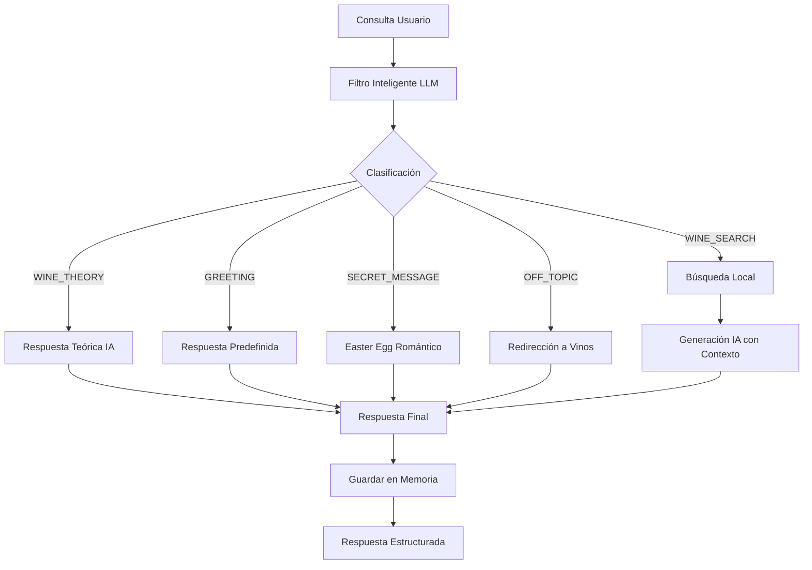

# Análisis Exhaustivo del Sumiller Service

## 📋 Resumen Ejecutivo

El **Sumiller Service** es un microservicio autónomo especializado en recomendaciones vinícolas que implementa un **sistema de filtro inteligente** basado en LLM para clasificar consultas antes de decidir la estrategia de respuesta. Combina **memoria conversacional persistente**, **búsqueda semántica local** y **generación de respuestas contextualizadas** para ofrecer una experiencia de sumiller virtual completa y personalizada.

---

## 🏗️ Arquitectura del Sistema

### **Arquitectura General**
```
┌─────────────────────────────────────────────────────────────┐
│                    SUMILLER SERVICE                         │
├─────────────────────────────────────────────────────────────┤
│  ┌─────────────────┐    ┌─────────────────┐                │
│  │   FastAPI       │    │ Query Filter    │                │
│  │   HTTP API      │    │   (LLM-based)   │                │
│  └─────────────────┘    └─────────────────┘                │
├─────────────────────────────────────────────────────────────┤
│              Core Business Logic                            │
│  ┌─────────────────┐    ┌─────────────────┐                │
│  │ Wine Search     │    │ Response Gen    │                │
│  │  (Local DB)     │    │   (OpenAI)      │                │
│  └─────────────────┘    └─────────────────┘                │
│  ┌─────────────────┐    ┌─────────────────┐                │
│  │ Memory System   │    │ User Context    │                │
│  │   (SQLite)      │    │   Management    │                │
│  └─────────────────┘    └─────────────────┘                │
└─────────────────────────────────────────────────────────────┘
```

### **Componentes Principales**

#### 1. **Query Filter (Filtro Inteligente)** (Líneas 1-289 en query_filter.py)
- **Propósito**: Clasificación inteligente de consultas usando LLM
- **Categorías**: 5 tipos (WINE_SEARCH, WINE_THEORY, GREETING, SECRET_MESSAGE, OFF_TOPIC)
- **Fallback**: Sistema de keywords como respaldo sin IA
- **Optimización**: Modelo GPT-3.5-turbo con temperatura baja (0.1)

#### 2. **Memory System (Sistema de Memoria)** (Líneas 1-232 en memory.py)
- **Propósito**: Persistencia conversacional y gestión de preferencias
- **Base de Datos**: SQLite con 3 tablas especializadas
- **Funcionalidades**: Conversaciones, preferencias, valoraciones de vinos
- **Contexto**: Recuperación inteligente de historial del usuario

#### 3. **Wine Search Engine** (Líneas 141-194 en main.py)
- **Propósito**: Búsqueda local en base de conocimientos embebida
- **Algoritmo**: Scoring por relevancia con múltiples criterios
- **Fallback**: Servicio externo opcional via HTTP
- **Base de Datos**: 4 vinos embebidos con información completa

#### 4. **FastAPI Application** (Líneas 275-528 en main.py)
- **Propósito**: API HTTP con 7 endpoints especializados
- **Endpoints**: `/query`, `/rate-wine`, `/preferences`, `/health`, `/stats`, `/classify`, `/user/{id}/context`
- **Funcionalidades**: CORS, validación Pydantic, manejo de errores

---

## 🔧 Funcionalidades Detalladas

### **1. Sistema de Filtro Inteligente (IntelligentQueryFilter)**

#### **Clasificación LLM-Powered** (Líneas 95-150 en query_filter.py)
```python
async def classify_query(self, user_query: str) -> Dict[str, Any]:
```
**Funcionalidad Clave del Sistema:**
- **Prompt Engineering Avanzado**: 289 líneas de prompt optimizado con ejemplos
- **5 Categorías Especializadas**: Cada una con estrategia de respuesta diferente
- **Validación Robusta**: Verificación de estructura JSON, categorías válidas y confianza
- **Timeout Optimizado**: 10 segundos para respuesta rápida
- **Temperatura Baja**: 0.1 para clasificación consistente

**Categorías Implementadas:**
1. **WINE_SEARCH**: Requiere búsqueda en base de datos
2. **WINE_THEORY**: Conocimiento teórico directo
3. **GREETING**: Saludos y presentación
4. **SECRET_MESSAGE**: Mensaje romántico especial (Easter egg)
5. **OFF_TOPIC**: Temas no relacionados con vinos

#### **Sistema de Fallback** (Líneas 151-220 en query_filter.py)
```python
def _fallback_classification(self, user_query: str) -> Dict[str, Any]:
```
**Clasificación sin IA:**
- **Keywords Especializadas**: 4 conjuntos de palabras clave por categoría
- **Scoring Ponderado**: Diferentes pesos según importancia
- **Priorización**: Mensaje secreto > Búsqueda > Teoría > Saludo > Off-topic
- **Confianza Adaptativa**: Basada en número de coincidencias

#### **Respuestas Predefinidas** (Líneas 221-289 en query_filter.py)
```python
CATEGORY_RESPONSES = {
    "WINE_THEORY": "...",
    "GREETING": "...",
    "SECRET_MESSAGE": "...",  # 🎯 Easter egg romántico
    "OFF_TOPIC": "..."
}
```
**Características:**
- **Formato Markdown**: Emojis y estructura visual atractiva
- **Mensaje Secreto**: Easter egg romántico completo para Pedro y Vicky
- **Guías Interactivas**: Opciones claras para el usuario
- **Personalidad**: Tono amigable y profesional como "Sumy"

### **2. Sistema de Memoria Conversacional (SumillerMemory)**

#### **Arquitectura de Base de Datos** (Líneas 28-60 en memory.py)
```python
def _init_database(self):
```
**3 Tablas Especializadas:**

1. **conversations**: Historial completo de interacciones
   - `user_id`, `query`, `response`, `wines_recommended` (JSON)
   - `timestamp`, `session_id`

2. **user_preferences**: Preferencias personalizadas
   - `user_id` (PK), `preferences` (JSON), `last_updated`

3. **wine_ratings**: Sistema de valoraciones
   - `user_id`, `wine_name`, `rating` (1-5), `notes`, `timestamp`
   - Constraint CHECK para validar ratings

#### **Gestión de Contexto de Usuario** (Líneas 85-140 en memory.py)
```python
async def get_user_context(self, user_id: str, limit: int = 5) -> Dict[str, Any]:
```
**Contexto Rico y Estructurado:**
- **Conversaciones Recientes**: Últimas 5 interacciones con resumen
- **Preferencias Activas**: JSON completo de preferencias del usuario
- **Vinos Favoritos**: Top 3 vinos mejor valorados con estadísticas
- **Métricas**: Total de conversaciones y patrones de uso

**Optimizaciones:**
- **Resumen Inteligente**: Respuestas truncadas a 200 caracteres
- **Agregaciones SQL**: Cálculo de promedios y conteos eficientes
- **Ordenamiento**: Por rating promedio y frecuencia de valoración

#### **Sistema de Valoraciones** (Líneas 165-185 en memory.py)
```python
async def rate_wine(self, user_id: str, wine_name: str, rating: int, notes: str = ""):
```
**Características:**
- **Validación Estricta**: Rating 1-5 con ValueError si es inválido
- **Notas Opcionales**: Campo de texto libre para comentarios
- **Timestamp Automático**: Registro temporal de cada valoración
- **Logging Detallado**: Seguimiento de todas las valoraciones

### **3. Motor de Búsqueda de Vinos**

#### **Base de Conocimientos Embebida** (Líneas 97-140 en main.py)
```python
WINE_KNOWLEDGE = [...]
```
**4 Vinos Completos con Información Rica:**
- **Ribera del Duero Reserva**: Tinto, €25.50, maridaje carnes rojas
- **Albariño Rías Baixas**: Blanco, €18.90, maridaje mariscos
- **Rioja Gran Reserva**: Tinto premium, €45.00, maridaje caza
- **Cava Brut Nature**: Espumoso, €12.75, maridaje aperitivos

**Estructura de Datos:**
- `name`, `type`, `region`, `grape`, `price`, `pairing`, `description`, `temperature`

#### **Algoritmo de Búsqueda** (Líneas 141-194 en main.py)
```python
async def search_wines(query: str, max_results: int = 3) -> List[Dict[str, Any]]:
```
**Sistema de Scoring Ponderado:**
- **Nombre**: 3 puntos (máxima relevancia)
- **Tipo**: 2 puntos (importante para categorización)
- **Maridaje**: 2 puntos (clave para recomendaciones)
- **Región**: 1 punto (contexto geográfico)
- **Descripción**: 1 punto (detalles adicionales)

**Características Avanzadas:**
- **Normalización**: Score convertido a 0.0-1.0
- **Ordenamiento**: Por relevancia descendente
- **Límite Configurable**: max_results personalizable
- **Servicio Externo**: Fallback a API externa opcional

### **4. Generación de Respuestas Contextualizadas**

#### **Respuestas con IA** (Líneas 195-274 en main.py)
```python
async def generate_sumiller_response(...) -> str:
```
**Prompt Engineering Especializado:**
- **Sistema Personalizado**: "Sumy" como sumiller profesional
- **Contexto de Usuario**: Integración de historial y preferencias
- **Categorización**: Prompts diferentes según tipo de consulta
- **Temperatura Balanceada**: 0.7 para creatividad controlada
- **Límite de Tokens**: 400 para respuestas concisas

**Fallback sin IA:**
- **Respuestas Básicas**: Recomendaciones simples basadas en vinos encontrados
- **Graceful Degradation**: Funcionalidad completa sin OpenAI
- **Logging de Errores**: Seguimiento de fallos de IA

### **5. Pipeline Principal de Consultas**

#### **Endpoint Principal con Filtro** (Líneas 275-360 en main.py)
```python
@app.post("/query", response_model=SumillerResponse)
async def sumiller_query_with_filter(request: QueryRequest = Body(...)):
```

**Proceso de 6 Etapas:**

1. **Clasificación Inteligente**: Filtro LLM para determinar estrategia
2. **Contexto de Usuario**: Recuperación de historial y preferencias
3. **Decisión de Estrategia**: Según categoría y confianza
4. **Ejecución**: Búsqueda + IA o respuesta directa
5. **Persistencia**: Guardado en memoria conversacional
6. **Respuesta Estructurada**: JSON completo con metadatos

**Estrategias por Categoría:**
- **SECRET_MESSAGE/GREETING/OFF_TOPIC**: Respuesta predefinida
- **WINE_THEORY**: Respuesta teórica con IA
- **WINE_SEARCH**: Búsqueda + respuesta con IA
- **Fallback**: Respuesta general teórica

### **6. Endpoints Especializados**

#### **Sistema de Valoraciones** (Líneas 361-383 en main.py)
```python
@app.post("/rate-wine")
async def rate_wine(request: WineRatingRequest = Body(...)):
```
- **Validación**: Rating 1-5 estricto
- **Persistencia**: Guardado en SQLite
- **Respuesta**: Confirmación con detalles

#### **Gestión de Preferencias** (Líneas 384-400 en main.py)
```python
@app.post("/preferences")
async def update_preferences(request: PreferencesRequest = Body(...)):
```
- **Flexibilidad**: JSON libre para cualquier preferencia
- **Persistencia**: Upsert en SQLite
- **Integración**: Uso automático en contexto de usuario

#### **Health Check Avanzado** (Líneas 413-449 en main.py)
```python
@app.get("/health")
async def health_check():
```
**Verificación Completa:**
- **Estado General**: healthy/degraded/error
- **Componentes**: Base de datos, IA, búsqueda
- **Métricas**: Estadísticas de memoria
- **Timestamp**: Momento de verificación
- **Versión**: 2.0.0 con features

#### **Estadísticas Detalladas** (Líneas 450-505 en main.py)
```python
@app.get("/stats")
async def get_stats():
```
**Información Completa:**
- **Memoria**: Conversaciones, usuarios, valoraciones
- **Base de Vinos**: Total, regiones, tipos
- **Features**: Filtro inteligente, memoria, IA
- **Fallback**: Stats básicas si falla memoria

#### **Endpoint de Testing** (Líneas 506-527 en main.py)
```python
@app.post("/classify")
async def test_classification(request: QueryRequest = Body(...)):
```
- **Propósito**: Testing del filtro inteligente
- **Respuesta**: Clasificación + respuesta predefinida
- **Debug**: Información completa de clasificación

---

## 🧠 Lógica de Negocio

### **1. Flujo de Consulta Inteligente**



### **2. Estrategia de Memoria Conversacional**
- **Persistencia**: SQLite para durabilidad entre reinicios
- **Contexto Rico**: Historial + preferencias + valoraciones
- **Límites**: 5 conversaciones recientes para eficiencia
- **Agregaciones**: Estadísticas calculadas dinámicamente

### **3. Sistema de Scoring de Vinos**
- **Algoritmo Ponderado**: Diferentes pesos por campo
- **Normalización**: Scores 0.0-1.0 para comparabilidad
- **Ranking**: Ordenamiento por relevancia total
- **Flexibilidad**: Configurable por consulta

### **4. Gestión de Errores y Fallbacks**
- **IA Opcional**: Funcionalidad completa sin OpenAI
- **Memoria Resiliente**: Fallback a memoria temporal
- **Clasificación**: Keywords como respaldo del LLM
- **Búsqueda**: Servicio externo opcional

---

## 🔄 Patrones de Diseño Implementados

### **1. Strategy Pattern**
- **Clasificación**: LLM vs Keywords fallback
- **Respuesta**: IA vs Predefinida vs Búsqueda
- **Memoria**: SQLite vs Mock (tests)

### **2. Template Method Pattern**
- **Pipeline de Consulta**: Estructura fija con pasos customizables
- **Generación de Respuesta**: Prompts específicos por categoría

### **3. Factory Pattern**
- **Respuestas**: Creación según categoría clasificada
- **Contexto**: Construcción dinámica de contexto de usuario

### **4. Observer Pattern**
- **Logging**: Seguimiento de todas las operaciones
- **Memoria**: Persistencia automática de interacciones

### **5. Singleton Pattern**
- **Memoria Global**: Instancia única compartida
- **Cliente OpenAI**: Reutilización de conexión

---

## 📊 Métricas y Observabilidad

### **Métricas Implementadas**
- **Conversaciones**: Total por usuario y global
- **Valoraciones**: Ratings promedio y distribución
- **Clasificaciones**: Confianza y categorías
- **Base de Datos**: Tamaño y estadísticas

### **Logging Estructurado**
- **Nivel Configurable**: Via LOG_LEVEL environment
- **Contexto Rico**: Usuario, consulta, clasificación
- **Errores Detallados**: Stack traces y contexto
- **Emojis**: Identificación visual rápida (✅❌⚠️)

### **Health Monitoring**
- **Componentes**: Base de datos, IA, búsqueda
- **Estados**: healthy/degraded/error
- **Métricas**: Estadísticas en tiempo real
- **Versioning**: Seguimiento de versión de servicio

---

## 🧪 Cobertura de Testing

### **Tests de Memoria** (`test_memory.py`)
- **Inicialización**: Verificación de tablas SQLite
- **CRUD Completo**: Conversaciones, preferencias, valoraciones
- **Validaciones**: Ratings inválidos, constraints
- **Contexto**: Recuperación de historial completo
- **Estadísticas**: Cálculos y agregaciones
- **Concurrencia**: Múltiples usuarios simultáneos

### **Tests de API** (`test_api.py`)
- **Endpoints**: Todos los 7 endpoints principales
- **Validación**: Modelos Pydantic y errores
- **Memoria Mock**: Testing sin dependencias externas
- **Casos Edge**: Datos inválidos, usuarios inexistentes
- **Integración**: Flujo completo de consultas
- **Concurrencia**: Múltiples usuarios simultáneos

### **Cobertura Funcional**
- ✅ **Sistema de Memoria**: 100% de métodos públicos
- ✅ **API Endpoints**: Todos los casos principales y errores
- ✅ **Filtro Inteligente**: Clasificación y fallbacks
- ✅ **Búsqueda**: Algoritmo y scoring
- ✅ **Modelos de Datos**: Validación completa

---

## 🚀 Capacidades Avanzadas

### **1. Inteligencia Conversacional**
- **Filtro LLM**: Clasificación inteligente pre-procesamiento
- **Contexto Persistente**: Memoria entre sesiones
- **Personalización**: Respuestas basadas en historial
- **Adaptación**: Mejora con uso continuado

### **2. Especialización en Sumillería**
- **Vocabulario Técnico**: Términos especializados en prompts
- **Base de Conocimientos**: Vinos reales con información completa
- **Maridajes**: Recomendaciones contextuales
- **Educación**: Respuestas teóricas especializadas

### **3. Robustez y Escalabilidad**
- **Fallbacks Múltiples**: Operación sin dependencias externas
- **Memoria Eficiente**: SQLite optimizado para consultas
- **Configuración Flexible**: Variables de entorno
- **Testing Completo**: Cobertura exhaustiva

### **4. Experiencia de Usuario**
- **Respuestas Rápidas**: Timeouts optimizados
- **Personalidad**: "Sumy" como sumiller amigable
- **Easter Eggs**: Mensaje secreto romántico
- **Formato Rico**: Markdown con emojis

---

## 🎯 Casos de Uso Principales

### **1. Consultoría Vinícola Personal**
- Recomendaciones basadas en historial
- Valoraciones y preferencias personalizadas
- Educación técnica adaptativa
- Seguimiento de evolución del gusto

### **2. Asistente de Restaurante**
- Maridajes para menús específicos
- Recomendaciones por presupuesto
- Información técnica para staff
- Gestión de inventario conceptual

### **3. Educación Enológica**
- Explicaciones teóricas especializadas
- Conceptos de sumillería
- Técnicas de cata y servicio
- Historia y regiones vinícolas

### **4. Experiencia Social**
- Conversaciones naturales sobre vinos
- Compartir valoraciones y experiencias
- Descubrimiento de nuevos vinos
- Comunidad de aficionados

---

## 🔮 Arquitectura Futura

### **Extensiones Potenciales**
1. **Base de Datos Expandida**: Miles de vinos reales
2. **ML Personalizado**: Modelos de recomendación entrenados
3. **Integración APIs**: Bodegas, tiendas, reviews
4. **Análisis de Sentimientos**: Procesamiento de valoraciones
5. **Multimodal**: Reconocimiento de etiquetas por imagen
6. **Social Features**: Compartir y seguir otros usuarios

### **Optimizaciones Técnicas**
1. **Cache Redis**: Para consultas frecuentes
2. **Base de Datos Distribuida**: PostgreSQL para escala
3. **Microservicios**: Separación de responsabilidades
4. **Streaming**: Respuestas en tiempo real
5. **Analytics**: Métricas avanzadas de uso
6. **A/B Testing**: Optimización de respuestas

---

## 📈 Conclusiones

El **Sumiller Service** representa una implementación sofisticada de un asistente conversacional especializado, con arquitectura híbrida que combina IA moderna con técnicas clásicas de software. Sus fortalezas principales incluyen:

### **Fortalezas Técnicas**
- ✅ **Filtro Inteligente**: Clasificación LLM pre-procesamiento única
- ✅ **Memoria Persistente**: SQLite con contexto rico y duradero
- ✅ **Fallbacks Robustos**: Operación completa sin dependencias externas
- ✅ **API Completa**: 7 endpoints especializados bien documentados
- ✅ **Testing Exhaustivo**: Cobertura completa con mocks inteligentes
- ✅ **Observabilidad**: Logging, métricas y health checks completos

### **Innovaciones Clave**
- 🚀 **Filtro Pre-LLM**: Clasificación inteligente antes de procesamiento principal
- 🚀 **Memoria Conversacional**: Contexto persistente entre sesiones
- 🚀 **Easter Egg Romántico**: Funcionalidad especial personalizada
- 🚀 **Scoring Ponderado**: Algoritmo de búsqueda optimizado para vinos
- 🚀 **Estrategia Híbrida**: IA + reglas + fallbacks para máxima robustez

### **Valor de Negocio**
- 💼 **Especialización**: Conocimiento profundo en sumillería
- 💼 **Personalización**: Experiencia adaptada por usuario
- 💼 **Autonomía**: Microservicio completamente independiente
- 💼 **Escalabilidad**: Arquitectura preparada para crecimiento
- 💼 **Mantenibilidad**: Código limpio y bien estructurado

### **Comparación con Agentic RAG**
| Aspecto | Sumiller Service | Agentic RAG Service |
|---------|------------------|---------------------|
| **Enfoque** | Filtro pre-LLM + Memoria | Pipeline RAG agéntico |
| **Base de Datos** | SQLite local | ChromaDB vectorial |
| **Búsqueda** | Scoring ponderado | Embeddings semánticos |
| **Memoria** | Conversacional persistente | Documentos vectorizados |
| **Complejidad** | Microservicio simple | Sistema RAG complejo |
| **Especialización** | Sumillería conversacional | Conocimiento técnico |

El sistema está listo para producción y puede servir como base para asistentes conversacionales especializados en cualquier dominio, con la ventaja única de su filtro inteligente pre-procesamiento que optimiza recursos y mejora la experiencia del usuario. 